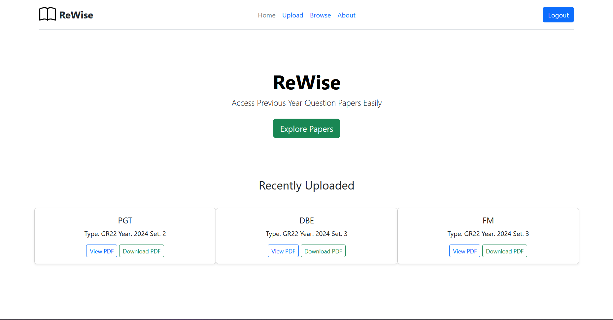

<p align="center">
  
</p>
# ReWise

**ReWise** is a web-based platform that allows colleges and universities to upload, browse, and download previous year question papers. Built with Flask, Firebase Authentication, and SQLAlchemy, it provides an admin-secured interface for organizing and filtering papers by subject, department, year, and type.

---

## Features

- Firebase-based Admin Authentication
- Upload PDFs of question papers (by subject, year, branch, and type)
- Filter and search by:
  - Subject
  - Year of Paper
  - Department (CSE, AIML, DS, etc.)
- Browse and preview/download uploaded papers
- Displays the 3 most recent uploads on homepage
- Only logged-in admins can upload content
- Easily extendable for any academic institution
  
<p align="center">
  
</p>

<p align="center">
  
  
</p>

<p align="center">
  
</p>
---

## Tech Stack

| Component          | Technology                      |
|-------------------|----------------------------------|
| Backend Framework | Flask (Python)                   |
| UI Framework      | Bootstrap 5                      |
| ORM               | SQLAlchemy                       |
| Auth              | Firebase Authentication via Pyrebase |
| File Uploads      | Stored in `/static/uploads`      |
| Database          | SQLite (`question-papers.db`)    |

---

## Getting Started

### 1. Clone the Repo

```bash
git clone https://github.com/fullstacksam23/rewise.git
cd rewise
```
### 2. Install Requirements

```bash
pip install -r requirements.txt
```
### 3. Set Up Firebase

* Go to Firebase Console
* Create a new project
* Enable Email/Password Authentication
* Add App (Web), copy the config and save as firebase_config.json in the root directory

```bash
{
  "apiKey": "YOUR_API_KEY",
  "authDomain": "YOUR_AUTH_DOMAIN",
  "projectId": "YOUR_PROJECT_ID",
  "storageBucket": "YOUR_STORAGE_BUCKET",
  "messagingSenderId": "YOUR_MSG_SENDER_ID",
  "appId": "YOUR_APP_ID",
  "measurementId": "YOUR_MEASUREMENT_ID",
  "databaseURL": "YOUR_DATABASE_URL"
}
```
### 4. Run the App

```bash
python app.py
```

## Folder Structure
```bash
rewise/
├── static/
│   └── uploads/           # Uploaded PDFs
├── templates/             # HTML templates
├── app.py                 # Main application
├── firebase_config.json   # Firebase credentials
├── requirements.txt
└── README.md
```
## Core Functionality
### Admin Login
* Route: /admin/login

* Authenticates using Firebase and stores session

* Required before accessing /upload

### Upload Question Papers
* Route: /upload

* Form allows:
    * PDF upload

    * Selecting branches via checkboxes

    * Selecting year of study

    * Selecting syllabus type and Set number

### Browse Papers
* Route: /browse

* Filter by:

    * Subject

    * Year

    * Department

* Paginated (10 papers per page)

### Homepage
* Route: /

* Displays 3 most recent uploads

### Admin Workflow
* Admin logs in at /admin/login

* Admin uploads a paper at /upload

* Users browse all papers at /browse


